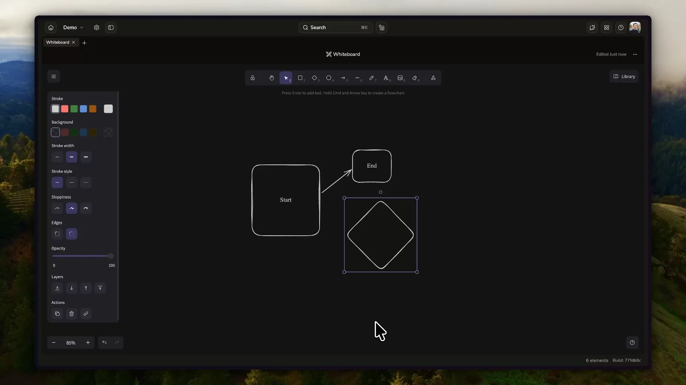

# Excalidraw

Sketch ideas, map workflows, and draw diagrams together inside Lunaris. Keep your
whiteboard in the workspace alongside the work it explains.



## Use cases

- Map a process with shapes, arrows, and labels.
- Sketch a product idea or system diagram during a team discussion.
- Include a drawing in a compiled document or PDF through Exporter.

## Features

- **Collaborative drawing:** edit a shared canvas with live persistence.
- **Workspace search:** find drawings by visible canvas text and named frames.
- **A familiar editor:** Excalidraw controls, light and dark themes, localized
  controls, and element counts.
- **Export integration:** provide drawings as images for compilation and PDF export
  when [Exporter](../exporter/README.md) is available.

## Try it

With the extension enabled in your workspace, create a drawing and start sketching.
Existing drawings from the former bundled extension open without migration.

## Technology

The extension combines Excalidraw, React, and Yjs through the Lunaris Plugin SDK.
It keeps the `lunaris.excalidraw` resource type and Yjs document layout used by the
former bundled extension. Lunaris manages persistence and organization permissions.

A local search indexer extracts visible text and named frames. Lunaris owns index
storage, lifecycle, ranking, and search UI. The optional `lunaris.exporter`
integration supplies an image representation of the drawing.

### Permissions and privacy

The extension runs in Lunaris' opaque-origin sandbox. It reads and writes the
active drawing through the host-mediated Yjs document. It makes no network
requests and does not send drawing data to third parties.

## Development

Run from `extensions/excalidraw`:

```sh
bun install
bun run test
bun run typecheck
bun run build
```
